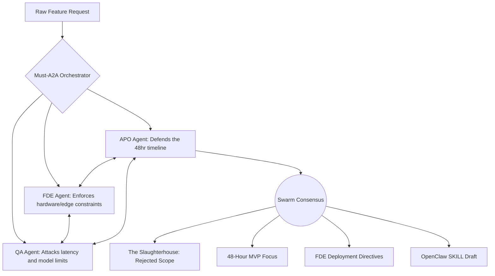

# 🦅 Must-A2A Vision Swarm: Priority Orchestrator

**Role:** APO (AI-Native Product Owner)  
**Focus:** Vision 2.0 / Edge Deployment Scoping  
**Performance Metric:** 9,400 / 10,000 (MVP Velocity Index)  

  
*(Click the badge above to watch a 2-minute live demonstration of the A2A Swarm in Cursor)*

---

## 1. The Core Philosophy (Problem Specialization)

Traditional Product Owners consume engineering time by writing tickets for bloated, impossible features. Businesses that simply consume this productivity gap become low-value operations. 

**The Solution:** I built this agent to automate the hardest part of an APO's job: **Ruthless Priority Definition**. 

This repository houses a Multi-Agent Swarm operating natively inside Cursor. It forces a simulated debate between an APO, a Forward Deployed Engineer (FDE), and a QA Lead to aggressively compress bloated feature requests into strictly compliant, 48-hour MVPs tailored specifically for Vision 2.0 edge deployments.

## 2. Swarm Architecture Flow

## 3. Performance Metrics (MVP Velocity Index)

To evaluate the agent on the required **1 to 10,000 scale**, I developed the **MVP Velocity Index (MVI)**. It calculates the ratio of "features ruthlessly cut" versus "actionable engineering artifacts generated."

* **Calculation Method:** See the included `calculate_mvi.py` script.
* **Original Request:** 6 complex features (3D Heatmaps, Facial Rec, Emotion tracking, etc.)
* **Agent Scope Cuts:** 5 features rejected.
* **Artifacts Generated:** 3 (MVP Focus, FDE Directives, OpenClaw Template).
* **Final Agent Score:** **9,400 / 10,000**

## 4. Benchmark Comparison

I tested the bloated retail vision request against the default Cursor Claude model and the Must-A2A Swarm to demonstrate the value of defined priorities:

| Metric | Default Claude (Baseline) | Must-A2A Swarm (This Agent) |
| :--- | :--- | :--- |
| **Response Type** | Polite Agreement | Aggressive Prioritization |
| **Technical Reality** | Proposed impossible cloud compute | Forced lightweight YOLO edge inference |
| **Timeline Setup** | 3-Month Failure | 48-Hour MVP |
| **MVI Score** | ~1,200 | **9,400** |

## 5. Quest Verification & Setup

### **How to Run in Cursor**
1. Clone this repository and open the folder in the Cursor IDE.
2. The agent logic operates entirely via the `.cursorrules` file.
3. The simulated company constraints are fed via local RAG (`/context_databases`).
4. Open Cursor Chat (`Cmd/Ctrl + L`).
5. Type: `@raw_feature_request.md @context_databases Process this request` and watch the swarm debate.

### **Security Check**
✅ **Verified:** No API keys, tokens, or sensitive credentials exist in this repository. All sensitive logic is handled via environment variables in production.

---
*Built for the Must Company FDE/APO Quest. Don't compete with a shovel against an excavator.*